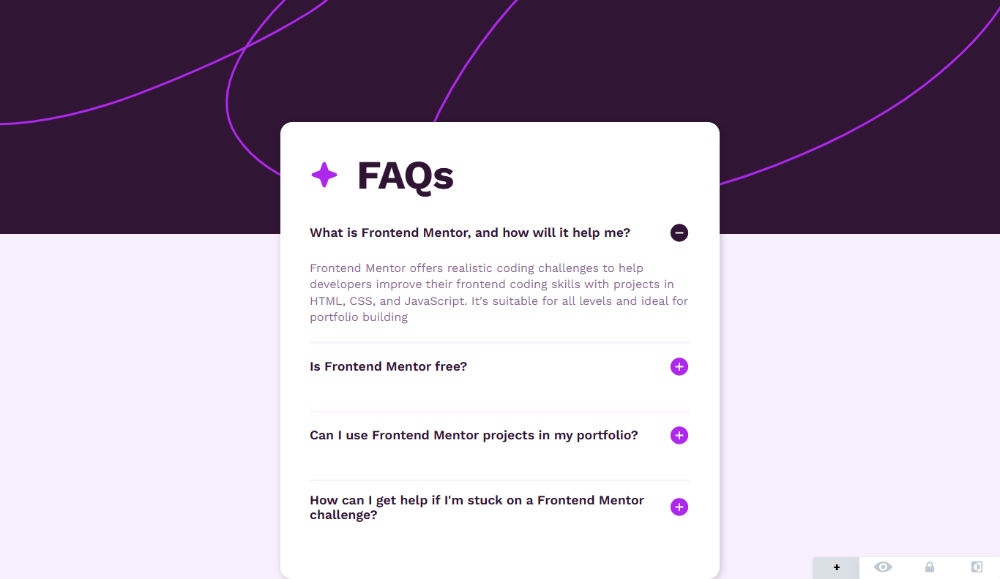
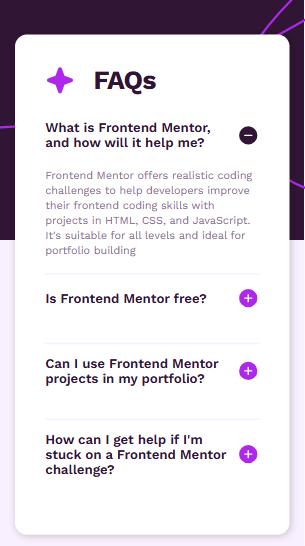

#  📌 FAQ Accordion

A sleek and responsive FAQ accordion built with HTML, CSS, and JavaScript. This project dynamically expands and collapses FAQ sections, providing a smooth and interactive user experience.


## 🛰 Live Demo  
🔗 [View Project](https://bhavikthakur.github.io/faq-accordion/)  

## 📸 Preview  
  
   

## 📌 Features  
✔️ Fully responsive design - mobile, tablet, and desktop. <br>
✔️ Smooth Animations – FAQ toggles with a clean expanding/collapsing effect. <br>
✔️ Accessible Markup – Proper HTML structure for better accessibility. <br>
✔️ Optimized Performance – Lazy loading and optimized assets for faster load times. <br>

## 🛠️ Built With  
- **HTML5** - Semantic markup for structure.   <br>
- **CSS3** - Modern styling with a mobile-first approach.  <br>
- **JavaScript (Vanilla)** - Handles FAQ toggle functionality.

## 📂 Folder Structure  
/project-folder <br>
│── /css <br>
│   ├── reset.css        # Resets default browser styles <br>
│   ├── styles.css       # Main styling file <br>
│   ├── media-queries.css # Responsive styles <br>
│── /images             # Contains all images & icons <br>
│── index.html          # Main HTML file <br>
│── README.md           # Documentation <br>


## 🔧 Setup & Usage  
1. Clone this repository:  
   ```bash
   git clone https://github.com/YOUR_GITHUB_USERNAME/social-links-profile.git    
2. Open index.html in your browser. 

## 📌 Future enhancement  
Add local storage to remember expanded FAQs.  <br>
Implement ARIA attributes for improved accessibility.  <br>
Integrate GSAP or Framer Motion for smoother animations.


## 🤝 Connect With Me  
👨‍💻 GitHub: [bhavikthakur](https://github.com/bhavikthakur)  <br>
💼 LinkedIn: [Bhavik Thakur](https://www.linkedin.com/in/bhavik-thakur/)  <br>
🐦 Twitter: [Bhavik Thakur](https://x.com/BhavikkThakur)  <br>
